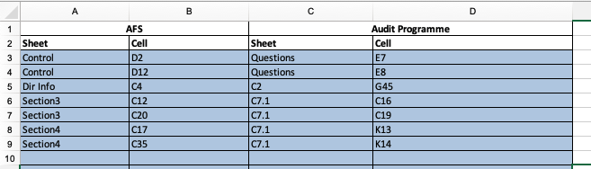

# Reports

## AFS Report Generation `AccountRptTask`

This is known as the main "account report generation".

### Process

- Takes "template" from configuration properties: e.g. `xlsx.template.name=allDocs_allDocs_all documents 20221012fixed.xlsm`

- Merge process `TemplateMergeProcessor`
  - driving Excel is the "plain" input one
  - finds all `excel-extract.merge.merge-cell-colors` (in `app-task` properties) 
  - merge if corresponding cell is present in "template"

- Audit Programme Mapping `AuditProgrammeMappingExtract`
  - Takes audit programme Excel: e.g.  `xlsx.template.auditprg.name=Audit programme - SME 20210421.xlsm`
  - reads mapping (source sheet, source cell, dest sheet, dest cell)

- Extract to Internal Format `TemplateParseProcessor`
  - internal format: `AccountData`
  - `extract()` basic information into `AccountData` instance
  - look through the  `metadata` tab: Each of the predefined sections have a "Control" column and "Yes/No Column".
  - parses `ControlCommand` to find the implementing class. The following classes are pre-defined:

| Control Name    | Implementing Class   |
|-----------------|----------------------|
| auditor heading | AuditorHeaderCommand |
| auditor footer  | AuditorFooterCommand |
| start           | BodyStartCommand     |
| end             | BodyEndCommand       |
| N/A             | ContentCommand       |
| heading         | HeadingCommand       |
| item            | ItemContentCommand   |
| table start     | TableStartCommand    |
| N/A             | TableContentCommand  |
| table end       | TableEndCommand      |

#### tables
- `TableStartCommand` 
  - trigger isInTable
  - set column widths
- `TableEndCommand`
  - exit isInTable

- Generation from Internal Format `GenerationServiceApachePOI`
  - use `template.docx` and write sections into it. `XWPFParagraph` is the "replacement point" -- 
    find for every section, header and footer.
  - for each line: `write()` will find the banner to fit into "Header" + SectionName + "Auditor" : `BannerService`
  - `write()` will call `doWrite()` which creates a new "Run" in the current paragraph and appends to it.
  - indents are calculated and for items, indent and number (for numbered list) is calculated.

- Audit Programme Processing `AuditProgrammeProcessor`
  - takes in the merged template Excel with new data. This is the source.
  - The target is the audit programmer template: e.g. `xlsx.template.auditprg.name=Audit programme - SME 20210421.xlsm`
  - Program extracts and populates just the cells indicated by the Audit Programme Mapping.

- zip all files and email.

## DBiz report generator `ExcelExtractTask`

Main generation program is `ExcelExtractTask`

- Merge process `TemplateMergeProcessor`
  - does the same job merging cells as above.

- extracts from "metadata" tab a `cutColumnsMap` which denotes the last column to cut, inclusive.
    e.g. if the column is M then every column after column M will be cut in the sheet, inclusive.

- inserts auditor banner in position named "auditorBanner"

- emails output excel

